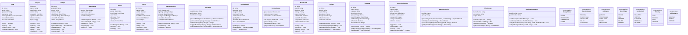

# Diagram

```mermaid
classDiagram
    class User {
        -id: String
        -email: String
        -password: String
        -username: String
        -subscriptionPlan: SubscriptionPlan
        -createdAt: DateTime
        -lastLogin: DateTime
        +login(): Boolean
        +logout(): void
        +updateProfile(): void
        +changePassword(): void
    }

    class Project {
        -id: String
        -name: String
        -description: String
        -userId: String
        -createdAt: DateTime
        -updatedAt: DateTime
        -isPublic: Boolean
        -tags: String[]
        +create(): void
        +update(): void
        +delete(): void
        +share(): String
        +duplicate(): Project
    }

    class Design {
        -id: String
        -projectId: String
        -name: String
        -version: Integer
        -sketchData: SketchData
        -renderSettings: RenderSettings
        -createdAt: DateTime
        -status: DesignStatus
        +createFromSketch(): void
        +generateRender(): RenderResult
        +updateSketch(): void
        +saveVersion(): void
        +exportImage(): File
    }

    class SketchData {
        -strokes: List~Stroke~
        -layers: List~Layer~
        -canvasSize: Dimension
        -resolution: Integer
        +addStroke(stroke: Stroke): void
        +removeStroke(id: String): void
        +addLayer(): Layer
        +mergeLayer(): void
        +toJSON(): String
    }

    class Stroke {
        -id: String
        -points: List~Point~
        -brushType: BrushType
        -color: Color
        -thickness: Float
        -opacity: Float
        -timestamp: DateTime
        +addPoint(point: Point): void
        +smooth(): void
        +simplify(): void
    }

    class Layer {
        -id: String
        -name: String
        -visible: Boolean
        -opacity: Float
        -blendMode: BlendMode
        -strokes: List~Stroke~
        -order: Integer
        +show(): void
        +hide(): void
        +moveUp(): void
        +moveDown(): void
    }

    class RenderSettings {
        -style: RenderStyle
        -lighting: LightingSettings
        -material: MaterialSettings
        -background: BackgroundSettings
        -resolution: Resolution
        -qualityLevel: QualityLevel
        +applyPreset(preset: String): void
        +customize(): void
        +validate(): Boolean
    }

    class AIEngine {
        -modelVersion: String
        -apiEndpoint: String
        -maxTokens: Integer
        +processSketch(sketch: SketchData): ProcessedSketch
        +generateRender(design: Design): RenderResult
        +enhanceImage(image: Image): Image
        +suggestMaterials(category: String): List~Material~
        +analyzeSketch(sketch: SketchData): AnalysisResult
    }

    class RenderResult {
        -id: String
        -designId: String
        -imageUrl: String
        -thumbnail: String
        -renderTime: Duration
        -quality: Float
        -metadata: RenderMetadata
        -status: RenderStatus
        +getImage(): Image
        +getMetadata(): RenderMetadata
        +retry(): RenderResult
    }

    class RenderQueue {
        -queue: Queue~RenderJob~
        -maxConcurrent: Integer
        -currentJobs: List~RenderJob~
        +addJob(job: RenderJob): void
        +processNext(): void
        +cancelJob(id: String): void
        +getQueueStatus(): QueueStatus
    }

    class RenderJob {
        -id: String
        -userId: String
        -designId: String
        -priority: Priority
        -status: JobStatus
        -submittedAt: DateTime
        -startedAt: DateTime
        -completedAt: DateTime
        -estimatedTime: Duration
        +start(): void
        +complete(): void
        +fail(error: String): void
        +cancel(): void
    }

    class Gallery {
        -id: String
        -userId: String
        -name: String
        -description: String
        -designs: List~Design~
        -isPublic: Boolean
        -createdAt: DateTime
        +addDesign(design: Design): void
        +removeDesign(designId: String): void
        +setPublic(isPublic: Boolean): void
        +getPublicGalleries(): List~Gallery~
    }

    class Template {
        -id: String
        -name: String
        -category: String
        -description: String
        -previewImage: String
        -sketchTemplate: SketchData
        -renderSettings: RenderSettings
        -isPremium: Boolean
        -downloadCount: Integer
        +apply(project: Project): Design
        +getByCategory(category: String): List~Template~
        +getFeatured(): List~Template~
    }

    class SubscriptionPlan {
        -id: String
        -name: String
        -price: Decimal
        -billingCycle: BillingCycle
        -features: List~Feature~
        -renderLimit: Integer
        -storageLimit: Integer
        -isActive: Boolean
        +upgrade(): void
        +downgrade(): void
        +cancel(): void
        +getRemainingCredits(): Integer
    }

    class PaymentService {
        -provider: String
        -apiKey: String
        +processPayment(amount: Decimal, userId: String): PaymentResult
        +refund(transactionId: String): RefundResult
        +updateSubscription(userId: String, planId: String): Boolean
        +getPaymentHistory(userId: String): Transaction[]
    }

    class FileStorage {
        -bucketName: String
        -accessKey: String
        -region: String
        +uploadFile(file: File): String
        +downloadFile(url: String): File
        +deleteFile(url: String): Boolean
        +getFileMetadata(url: String): FileMetadata
    }

    class NotificationService {
        -emailProvider: String
        -pushProvider: String
        +sendEmail(email: EmailMessage): void
        +sendPush(notification: PushNotification): void
        +notifyRenderComplete(userId: String, result: RenderResult): void
        +notifySubscriptionExpiry(userId: String): void
    }

    %% Enumeraciones
    class DesignStatus {
        <<enumeration>>
        DRAFT
        PROCESSING
        COMPLETED
        FAILED
    }

    class RenderStatus {
        <<enumeration>>
        PENDING
        PROCESSING
        COMPLETED
        FAILED
        CANCELLED
    }

    class JobStatus {
        <<enumeration>>
        QUEUED
        PROCESSING
        COMPLETED
        FAILED
        CANCELLED
    }

    class BrushType {
        <<enumeration>>
        PENCIL
        PEN
        MARKER
        BRUSH
        ERASER
    }

    class RenderStyle {
        <<enumeration>>
        REALISTIC
        SKETCH
        CARTOON
        TECHNICAL
        ARTISTIC
    }

    class Priority {
        <<enumeration>>
        LOW
        NORMAL
        HIGH
        URGENT
    }

    class BillingCycle {
        <<enumeration>>
        MONTHLY
        YEARLY
        LIFETIME
    }

```
